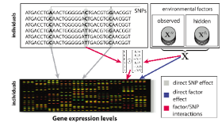



PANAMA and LIMMI are probabilistic models that account for confounding and environmental factors in eQTL studies.

### PANAMA

 

Hidden confounding factors, such as unobserved covariates or unknown subtle environmental perturbations can create spurious false associations or mask real genetic association signals. In contrast to previous methods, PANAMA learns hidden factors jointly with the effect of prominent genetic regulators. As a result, this new model can more accurately distinguish true genetic association signals from confounding variation.

[N. Fusi,O. Stegle and N. D. Lawrence, _"Joint modelling of confounding factors and prominent genetic regulators provides increased accuracy in genetical genomics studies"_, PLoS Computational Biology, 2012](http://www.ploscompbiol.org/article/info:doi/10.1371/journal.pcbi.1002330)

### LIMMI

 

LIMMI is a novel approach to detect genotype-environment interactions with unmeasured environmental
factors, and is able to recover the unmeasured environmental state solely from gene expression data.
Once learnt, these variables can be used in genetic analyses to investigate interactions between environmental factors and genotype with a regulatory effect on gene expression levels.

**PANAMA and LIMMI share the same codebase, and it's possible to switch between them by passing the --limmi command line argument**

* * *

#### LICENSE

If you want to use PANAMA or LIMMI for non-commercial purposes, the code is available under a modified GPL v2 license. The modifications are:

* If you are trying to validate a scientific claim, you can keep your changes confidential until publication.
* If you release any claims or data that were supported or generated by the program or a modification thereof, in whole or in part, You will release any inputs supplied to the program and any modifications You made. This License will be in effect for the modified program.

If you can't/don't wish to meet these terms, please let us know.