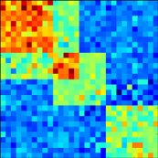



 PANAMA and LIMMI are probabilistic models that account for confounding and environmental factors in eQTL studies.

### PANAMA

 Hidden confounding factors, such as unobserved covariates or unknown 
subtle environmental perturbations can create spurious false associations or mask real genetic association signals. In contrast to previous methods, PANAMA learns hidden factors jointly with the effect of prominent genetic regulators. As a result, this new model can more accurately distinguish true genetic association signals from confounding variation.

[N. Fusi,O. Stegle and N. D. Lawrence, _"Joint modelling of confounding factors and prominent genetic regulators provides increased accuracy in genetical genomics studies"_, PLoS Computational Biology, 2012](http://www.ploscompbiol.org/article/info:doi/10.1371/journal.pcbi.1002330)

### LIMMI
LIMMI is a novel approach to detect genotype-environment interactions with unmeasured environmental
factors, and is able to recover the unmeasured environmental state solely from gene expression data.
Once learnt, these variables can be used in genetic analyses to investigate interactions between environmental factors and genotype with a regulatory effect on gene expression levels.

**PANAMA and LIMMI share the same codebase, and it's possible to switch between them by passing the --limmi command line argument**

* * *

## Installation

#### Prerequisites:
Python, Numpy and Scipy, Matplotlib, Ipython, Cython, pandas, pygp, sphinx

If you already have Python and pip installed, probably pip will take care of installing all the dependencies. *If you don't know how to install these libraries, perhaps the easiest way is to download the Entougth Python Distribution*. 

#### Installing PANAMA and LIMMI
There are two options:
1. Running `pip install panama` (easiest)
2. Download panama and pygp, extract them, and then run 
`sudo python setup.py install` in the "pygp" directory first, and then in the "panama" directory.

* * *

## Data

This is the simulated data we used in the paper:
[simulated.zip](http://ml.sheffield.ac.uk/qtl/panama/data/simulated.zip)

Thanks to Leonid Kruglyak, Erin Smith and Rachel Brem we can also provide the yeast dataset we used for most of our experiments
[yeast_data.zip](http://ml.sheffield.ac.uk/qtl/panama/data/yeast.zip)

* * *
## Usage 

### Basic usage
PANAMA includes a script that lets you access the basic functionalities without too much pain.
After installing PANAMA, from a terminal, run:

`$ panama expression_data.csv snp_data.csv`

Where expression_data.csv is a Comma Separated Values file containing the gene expression data in the following format

         sample1, sample2, ..., sampleN
  gene1  value ,  value , ...,  value
  gene2  value ,  value , ...,  value
  ...
  geneN
and snp_data.csv contains the SNP data encoded as [0,1,2] in the following format

        sample1, sample2, ..., sampleN
  SNP1  value ,  value , ...,  value
  SNP2  value ,  value , ...,  value
  ...
  SNPQ

If you need to load data in another format, just contact us.
Optional arguments: 
_-p num_processes_
in order to facilitate the analysis of larger datasets, PANAMA implements a cluster interface that can work seamlessly on the local machine, on a group of machines on the local network (via SSH), on a local cluster (via SunGrid), or on Amazon EC2 (Elastic Cloud Computing). In order to use this feature, you need to have an ipcluster instance running. If you have Ipython 0.12 installed on your machine, running PANAMA on multiple cores on the local machine just requires a ipcluster start from the command line.
For ipython 0.10, the equivalent command would be ipcluster local -n num_processes. PANAMA automatically detects the Ipython version, so no further input is necessary. Read the Ipython documentation for more informations on how to run on networked machines, on clusters and on Amazon EC2

_-d output_directory_
specify an output directory (default: the current directory)

_-l logging_level_
how much output do you want from PANAMA? There are 4 possible choices: debug, info, warning, error. The default level is "info", so you will get a good idea of what PANAMA is actually doing in any given moment.

### Advanced usage
Some of the features of PANAMA can't be accessed using the simple panama script provided or need further setup. Here's a list of features that have been implemented and can be accessed through the python API:

imputation of missing genotypes (available from panama.utilities.imputation)
threading configuration for the Intel Math Kernel Library ™(available from panama.utilities.MKL)
reading/writing files in HDF5 (available from panama.utilities.io_wrapper)
storing intermediate results in HDF5 (available from panama.core.testing)
If you want to call PANAMA directly from python, just take a look at the PANAMA function in panama.core.run. The expected arguments are:

expr (required) an NxD numpy array, where N is the number of samples and D is the number of genes.
snps (required) an NxQ numpy array, where N is the number of samples and Q is the number of SNPs.
tf_correction = False [True|False] remove broad genetic effects? This will result in more uniform pvalues, but it will also results in an overcorrection of the data (see the paper for a more extended explanation).
pop_struct = False [True|NxN numpy array] if pop_struct = True, a population structure covariance matrix will be calculated using the genotypes. You can explicitly pass your own population structure covariance matrix as a NxN numpy array.
parallel = True [True|False] run PANAMA in parallel. If True, please also pass the desired number of jobs to run as jobs = num_jobs.
statistics = False [True|False] print some statistics like genomic control, number of significant qvalues, and so on..
If you don't want to hack your way around python, just contact us. We can make some functionalities available from the main script.

* * *
## LICENSE

If you want to use PANAMA for non-commercial purposes, the code is available under a modified GPL v2 license. The modifications are:

* If you are trying to validate a scientific claim, you can keep your changes confidential until publication.
* If you release any claims or data that were supported or generated by PANAMA or a modification thereof, in whole or in part, You will release any inputs supplied to PANAMA and any modifications You made. This License will be in effect for the modified program.

If you can't/don't wish to meet these terms, drop us an email, we can waive them if necessary.
If you want to use PANAMA for commercial purposes, drop us an email as well.